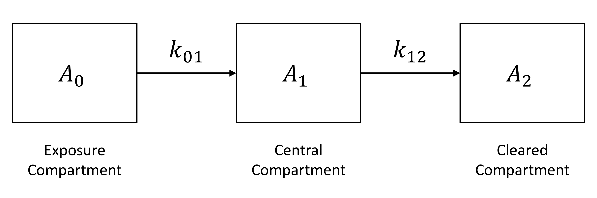

```{r setup, include=FALSE}
knitr::opts_chunk$set(
  echo = TRUE,
  warning = FALSE,
  collapse = TRUE,
  comment = "#>"
)
```

## Input Variables

The **MCSimMod** package allows one to solve initial value problems for ordinary differential equation (ODE) models that include input variables. These are variables that may vary in time, but which are not state variables and which are independent of other model variables (including parameters). The authors of the **deSolve** package use the term "forcing function" to describe such input variables. Because the **MCSimMod** package uses functions from the **deSolve** package to solve ODE initial value problems, it uses **deSolve** forcing funtions to implement input variables. One can learn more about **deSolve** forcing functions in the [deSolve package documentation](https://CRAN.R-project.org/package=deSolve/deSolve.pdf). Here we will demonstrate how to perform simulations with a model that includes a single input variable. 

## A Classical Pharmacokinetic Model

For this demonstration, we will use the classical pharmacokinetic (PK) model illustrated in the figure below.
```{r, echo=FALSE, fig.cap="A classical PK model", out.width = '100%'}

```

In this ODE model, there are three "compartments" (represented as rectangular boxes in the figure) for which amounts of substance are tracked as state variables: $A_0$ represents the amount of substance in the "exposure compartment" (e.g., the gut in an oral dosing scenario); $A_1$ represents the amount of substance in the "central compartment" (e.g., in the blood of the organism); and $A_2$ represents the amount that has been cleared from the body (e.g., via metabolism or excretion). Thus,
\begin{align}
  \frac{\textrm{d}}{\textrm{d}t}A_0(t) &= -k_{01} A_0(t), \\
  \frac{\textrm{d}}{\textrm{d}t}A_1(t) &= k_{01} A_0(t) - k_{12} A_1(t), \textrm{ and} \\
  \frac{\textrm{d}}{\textrm{d}t}A_2(t) &= k_{12} A_1(t), \\
\end{align}
where $k_{01}$ is the rate constant (with units of one over time) that, along with the value of $A_0$, determines the rate of delivery of the substance to the body and $k_{12}$ is the rate constant (with units of one over time) that, along with the value of $A_1$, determines the rate of clearance from the body. In addition to the state variables, the model includes an "output" variable, $C$, that represents the concentration in the central compartment. The value of this variable is computed as
\begin{equation}
  C(t) = \frac{A_1(t)}{V_\textrm{d}},
\end{equation}
where $V_\textrm{d}$ is a variable representing the effective volume of the central compartment, or the "volume of distribution." For this model,
\begin{equation}
  V_\textrm{d}(t) = V_\textrm{d}^\textrm{C} \cdot M(t),
\end{equation}
where $V_\textrm{d}^\textrm{C}$ is a scaling constant (parameter) and $M(t)$ is an input variable that represents body mass. The model also includes an output variable,
\begin{equation}
  A_\textrm{tot} = A_0 + A_1 + A_2,
\end{equation}
that represents the total amount of substance in the system. Finally, the model includes an additional state variable that represents the area under the concentration vs. time curve (AUC), as this is a quantity that is often computed in pharmacokinetic analyses. The AUC for the period from time $0$ to time $t$ is given by $\textrm{AUC}(t) = \int_0^t C(\tau) \, \textrm{d}\tau$ and thus the state equation for this quantity is
\begin{equation}
  \frac{\textrm{d}}{\textrm{d}t} \textrm{AUC}(t) = C(t).
\end{equation}

In order to solve an initial value problem for the classical PK model, one needs to provide the values of the three parameters ($k_{01}$, $k_{12}$, and $V_\textrm{d}^\textrm{C}$), an input variable ($M(t)$), and the initial values of the four state variables ($A_0$, $A_1$, $A_2$, and $\textrm{AUC}$).

## MCSim Model Specification

We used the [GNU MCSim](https://www.gnu.org/software/mcsim/) model specification language to implement the classical PK model. The complete MCSim model specification file for this model, `pk1_input.model`, can be found in the `extdata` subdirectory of the **MCSimMod** package.

The model specification file uses the text symbols `A0`, `A1`, `A2`, and `AUC` to represent the state variables $A_0$, $A_1$, $A_2$, and $\textrm{AUC}$, respectively, and the text symbols `k01`, `k12`, and `VdC` to represent the parameters $k_{01}$, $k_{12}$, and $V_\textrm{d}^\textrm{C}$, respectively. The text symbol `M_in` is used to represent the input variable $M$ and the text symbol `M` is used to represent an output variable that is equal to $M$ at all times. (Including this "output" variable in the model allows one to obtain values of $M$ at various times once a simulation has been performed.) The text symbols `C` and `Atot` represent the output variables $C$ and $A_\textrm{tot}$. In addition, the text symbols `A0_init`, `A1_init`, `A2_init`, and `AUC_init` represent parameters that can be used to set (via the `updateY0()` method of the `Model` class) the initial conditions of the state variables.

## Building the Model

First, we load the **MCSimMod** package as follows.
```{r}
library(MCSimMod)
```

Using the following commands, we create a model object (i.e., an instance of the `Model` class) using the model specification file `pk1_input.model` that is included in the **MCSimMod** package.
```{r, results='hide'}
# Get the full name of the package directory that contains the example MCSim
# model specification file.
mod_path <- file.path(system.file(package = "MCSimMod"), "extdata")

# Create a model object using the example MCSim model specification file
# "pk1_input.model" included in the MCSimMod package.
pk1_mod_name <- file.path(mod_path, "pk1_input")
pk1_mod <- createModel(pk1_mod_name)
```

Once the model object is created, we can "load" the model (so that it's ready for use in a given R session) as follows.
```{r, results='hide'}
# Load the model.
pk1_mod$loadModel()
```

## Predicting the Blood Concentration of a Substance Following Oral Dosing

Suppose we want to predict the blood concentration of a substance during the 20-hour period following oral ingestion of 100 mg of the substance. Let's assume that the oral absorption rate constant ($k_{01}$) is 1.0 h$^{-1}$, the clearance rate constant ($k_{12}$) is 0.5 h$^{-1}$, and the volume of distribution scaling constant ($V_\textrm{d}^\textrm{C}$) is 0.1 L/kg. These are the default values of those model parameters given in the model specification file, and we can verify this with the following commands.
```{r}
pk1_mod$parms
pk1_mod$Y0
```

Suppose the animal being dosed has a body mass of 0.25 kg initially (i.e., at the beginning of the simulation) and a body mass of 1.0 kg 20 hours later. (Admittedly, this is a large relative increase in body mass over a 20-hour period, but serves to illustrate the diluting effect of increased body mass on concentration, as we shall see.) We can define a matrix that lists the values of the body mass at various times. The default behavior of the **deSolve** integrators is to use linear interpolation to determine values of input variables at times that are not listed, but other options are available. We can create an appropriate input variable matrix for our simulation (and examine it) using the following commands.
```{r}
# Define body mass input.
M_table <- cbind(times = c(0, 20), M_in = c(0.25, 1.0))
head(M_table)
```

We can perform a simulation that provides results for the desired output times (i.e., $t = 0, 0.1, 0.2, \ldots, 20.0$) using the following commands.
```{r, results='hide'}
# Define output times for simulation.
times <- seq(from = 0, to = 20, by = 0.1)

# Run simulation.
out <- pk1_mod$runModel(times, forcings = list(M_table))
```

We can perform a second simulation for which body mass remains constant at 0.25 kg using the following commands.
```{r}
# Define body mass input.
M_table2 <- cbind(times = c(0, 20), M_in = c(0.25, 0.25))

# Run simulation.
out2 <- pk1_mod$runModel(times, forcings = list(M_table2))
```

## Examining the Results

The results of the two simulations were stored in "matrix" data structures named `out` (for the time-varying body mass simulation) and `out2` (for the constant body mass simulation). In each matrix, there is one row for each output time, and one column for each state variable and each output variable. The first five rows of `out` are shown below. Note that the independent variable, which is $t$ in the case of the classical PK model, is always labeled "time" in the output data structure.
```{r, echo=FALSE, results='asis'}
library(knitr)
kable(out[1:5, ])
```

We can create a visual representation of the simulation results. For example, we can plot the concentration vs. time using the following commands.
```{r, fig.dim=c(6, 4), fig.align='center'}
# Plot simulation results.
plot(out[, "time"], out[, "C"],
  type = "l", lty = 1, lwd = 2, xlab = "Time (h)",
  ylab = "Concentration (mg/L)", ylim = c(0, 2500)
)
lines(out2[, "time"], out2[, "C"], lty = 2, lwd = 2)
legend("topright",
  legend = c("Varying Body Mass", "Constant Body Mass"),
  lty = c(1, 2), lwd = 2
)
```
Note that for the "varying body mass" simulation, the increase in body mass had a diluting effect on concentration. That is, concentrations tended to be less for the "varying body mass" scenario than for the "constant body mass" scenario because increases in body mass ($M$) and corresponding increases in volume of distribution ($V_\textrm{d}$) caused concentration ($C$) to decrease more rapidly than would be the case for a constant body mass scenario in which clearance processes alone effect reductions in concentration.
